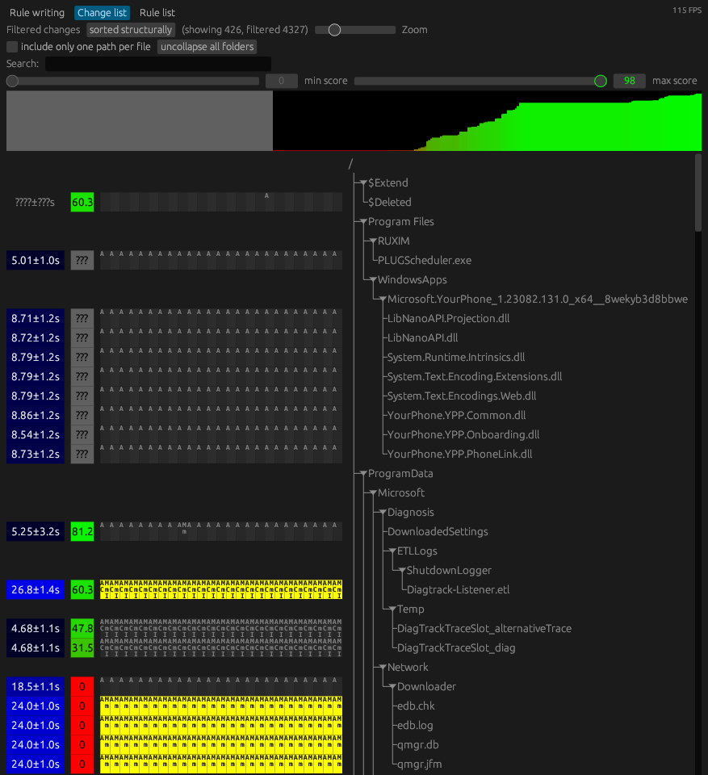

# bark - behavior anomaly reconnaissance kit

## Overview

Bark is a tool developed as part of my master's thesis to address the challenge of determining normal computer system behavior by analyzing differences between file system snapshots.
The tool implements the theoretical model that is described in detail in the thesis.

## Purpose

The primary goal of bark is to aid expert users in understanding system behavior and identifying anomalies in comparison to a reference implementation of the same or a similar system.
For example differences between snapshots created by [sniff](https://github.com/aticu/sniff) of a freshly installed Windows 10 system can be taken to develop rules for the normal behavior of that system.
Later, the difference between two or more snapshots of another Windows 10 system can be compared against that normal system behavior to detect anomalies in the behavior of the second system.
Users should interpret bark's findings as indicators rather than definitive conclusions, prompting further investigation into the root cause of flagged anomalies.

## Features

- **Behavior Modeling:** Bark allows users to develop a model of a specific system's behavior using file system snapshots.
- **Anomaly Detection:** The tool employs statistical methods to identify abnormal entries in the file system based on the previously established normal system behavior.
- **Change Inspection:** Users can inspect changes made within a specific set of snapshots and evaluate how well those changes align with the developed behavior model.

## Target audience

Bark is designed for expert users who seek a deeper understanding of system behavior or aim to uncover anomalies within a system.
It is particularly useful for users who want to compare a system's behavior against a reference implementation or detect anomalies that might be indicative of malicious activity.

## Usage and further documentation

For a comprehensive understanding of bark's usage, as well as its design, refer to the documentation provided in the [thesis](thesis.pdf).
The "implementation" section focuses on the usage, whereas the "modeling behavior" section focuses on the model that bark was designed around.

## Important considerations

- Users should interpret bark's findings as indicators, prompting further investigation into anomalies rather than conclusive evidence.
- Bark requires the system to run at least once to exhibit the desired behavior for analysis.

## License

Bark is released under the MIT license.
For more information, refer to the license file provided with this distribution.
